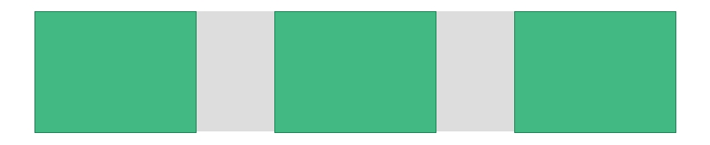

# CSS技巧：Flex弹性布局大型攻略
在项目开发过程中，我们经常会遇到一些关于布局方面的问题。  
一个好的布局能够让你在接下来的开发过程中事半功倍，甚至可以连带将响应式一并解决。  
***
## 引入
比如说我们希望实现这样子的布局  

假设，我们的html代码是这样的：
```
<div class="box father">
  <div class="box_i son"></div>
  <div class="box_i son"></div>
  <div class="box_i son"></div>
</div>
```
在这里，我设定了.father和.son的公共样式：  
其中，父级盒子使用了灰色背景色，子级盒子使用了绿色为背景色，为方便看出边框，使用深绿色作为边框。实际布局我将使用.box和.box_i来实现
```
.father {
    width: 800px;
    height: 200px;
    background-color: #eeeeee;
    margin: 0 auto;
}

.son {
  height: 100%;
  background: #42b983;
  border: 1px solid #148351;
  width: 25%;
}
```
传统的css布局大多都是这样子的：
```
.box{
  float:left;
  overflow:hidden;  //此处也可以给.box增加一个after伪元素来进行clearfix的操作
}

.box_i:nth-child(2){
  margin: 0 12.5%;
}
```
> 什么是clearfix?  
clearfix是常用的一种清除浮动的方式，当父元素是标准级，子元素是浮动级时，父元素会因为子元素的浮动而失去高度。我们常用的做法是给父元素overflow:hidden或者使用clearfix。  
```
// 比如在上面的例子中，我们如果不使用overflow:hidden，就可以这么写:  
.box::after {
  content: "";
  display: block;
  height: 0;
  clear: both;
  visibility: hidden;
}
```
```
// 如果你使用的是scss你甚至可以将这个实用的方法编写成一个mixin(混合器)
@mixin clearfix {
  &::after {
    content: "";
    display: block;
    height: 0;
    clear: both;
    visibility: hidden;
  }
}
// 实际使用
.box{
  @include clearfix;
}
```
话题扯回来。。。你可以看到，使用传统布局时，有一下几个问题
* 我们必须要知道父元素和子元素的宽度才可以做到这种布局。但是很多情况下，我们是得不到这个宽度的。
* 使用float时，必须要做清除浮动，否则很有可能对后面的布局造成影响。
* 如果这个布局需要改进成响应式，很有可能需要用到@media的媒体查询。

## flex布局
那么接下来，我们该请出我们的重量级嘉宾登场了！！！  
flex顾名思义就是弯曲收缩的意思，但是在css布局中，我们称它为**弹性布局**。  
前端大牛阮一峰曾经写过两篇关于flex的文章，非常的有意思，分别是[语法篇](http://www.ruanyifeng.com/blog/2015/07/flex-grammar.html)和[实例篇](http://www.ruanyifeng.com/blog/2015/07/flex-examples.html)。在这里给出了非常详细的介绍。本文中提及的部分图片和原理都会取自于这两篇博客，在这里感谢阮老师的分享！！！  
以下为flex的各浏览器兼容性：  
  
从上图中，令人头大的IE只能兼容到IE10，但是以及能够应付大部分项目的需求了。  
那么我在本文并不会涉及到flex的所有属性或者使用方法，我只会对我在项目中常用的做一定的解释，同时阐述一下我的拙见。  
### 作用在父级的属性
#### display:flex;
这句话就意味着，我要在这个元素内使用flex布局了，打个比方就相当于是那些js库的init的。  
无论是块级元素还是行内元素都可以使用flex。  
> 注意：当你使用了flex布局之后，该元素的所有子元素的浮动(float)，清除浮动(clear)以及vertical-align都将失效。  
#### flex-direction  
可选值：row | row-reverse | column(默认) | column-reverse  
  
这个属性其实非常容易被遗忘，包括我在内，在这里举个栗子！
  
比如说，现在需要形成这样的布局，如果我不提示各位使用flex，我相信绝大多数人都会直接按照默认布局排列，包括我在内。因为这真的是一件毋庸置疑的事，那么我们如果使用flex比起默认布局会有哪些优势呢？  
* 如果说，原本客户需要将这么几个item纵向排列，那么我们自然而然的使用默认布局，这样又快又方便。但是哪天客户说：你这个纵向排列上下太长了，你能不能帮我改成横向排列。这时候，我们就需要float:left;overflow:hidden;margin-left:10px;等等操作。但是如果是flex呢，你只需要改变一个属性即可。那么反向也是同样道理。
* 默认布局控制item之间的间隔一般会使用margin，但是在控制距离方面必然是不如flex的，这个我会在后文提及。  
#### flex-wrap
可选值：nowrap(默认) | wrap | wrap-reverse  
1. nowrap:不换行  
 
2. wrap:换行
 
3. wrap-reverse:反向换行
 
这个属性图上已经说明的很清楚了，就不再多说了。  
---
（未完待续）